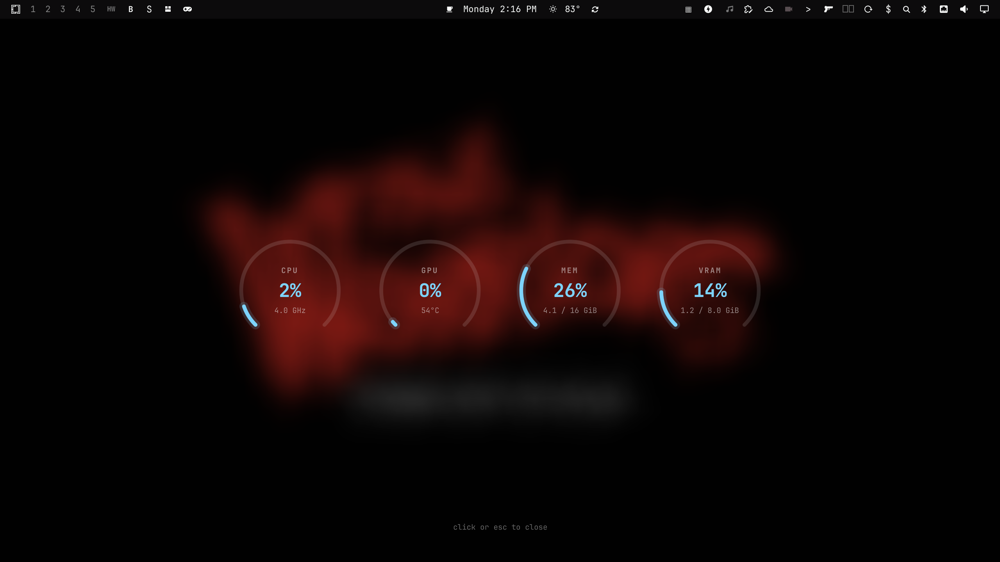

# Hardware Monitor Overlay


A fullscreen blurred overlay showing live CPU, GPU, memory, and GPU VRAM
as centered dials — a HUD you toggle on, glance at, and dismiss.

| | |
|---|---|
| **Plugin id** | `hwmonitor.overlay` |
| **Requires** | Omarchy 4 (the Quickshell shell) |
| **Where** | Every screen, the Overlay layer, on top of everything |
| **Bar** | **HW** text icon (right section by default) — click to open/close |
| **Dismiss** | Click anywhere on the overlay, or press Esc |
| **Network** | None — reads `/proc` and `/sys` directly |

It's built two ways at once:

- The blurred backdrop is the **Wallpaper Blur** plugin's `Surface.qml`
  technique, reused as-is (resolve the current wallpaper symlink, draw it
  with `QtQuick.Effects.MultiEffect`) — just moved from the Background layer
  to the Overlay layer, and made toggleable instead of always-on. If the
  Omarchy wallpaper link is unavailable, it also finds the image passed to a
  running `swaybg` process.
- The sensor readings are the **Hardware Monitor** plugin's data layer
  (`Service.qml`, `Model.js`, `hw-probe`), copied over unmodified — they
  have no dependency on that plugin's bar-widget code or the shell's theme
  singleton, so they drop in cleanly.

The dial itself (`Dial.qml`) is a new, self-contained rewrite of that
plugin's arc gauge — same 270° arc look, but with its own small neutral
palette instead of importing the shell's `qs.Commons` theme, so this plugin
has zero dependency on any other plugin being installed.

## Publishing this repo

From inside this folder:

```bash
git init
git add .
git commit -m "Hardware Monitor Overlay"
git branch -M main
git remote add origin https://github.com/maiosx/hardware-monitor.git
git push -u origin main
```

(Create the empty `hardware-monitor` repo on GitHub first, without a README
or license — this folder already has both.)

## Install

```bash
omarchy plugin add https://github.com/maiosx/hardware-monitor.git
omarchy plugin enable hwmonitor.overlay
```

Or let the install script do both and restart the shell for you:

```bash
curl -fsSL https://raw.githubusercontent.com/maiosx/hardware-monitor/main/install | bash -s -- --yes
```
If the GPU sensor isn't working for some reason type this with your username in it and restart your shell
```bash
chmod +x /home/USER/.config/omarchy/plugins/hwmonitor.overlay/hw-probe
```
Suggested keybind in `~/.config/hypr/bindings.lua`:

```lua
o.bind("SUPER + H", "hwmonitor.overlay", "omarchy-shell hwmonitor.overlay toggle")
```

### From a local copy (no GitHub repo needed)

```bash
cp -r hwmonitor-overlay ~/.config/omarchy/plugins/hwmonitor.overlay
omarchy plugin enable hwmonitor.overlay
omarchy restart shell
```

## Updating

```bash
~/.config/omarchy/plugins/hwmonitor.overlay/update
```

## Uninstall

```bash
omarchy plugin disable hwmonitor.overlay   # off, nothing removed
omarchy plugin remove hwmonitor.overlay    # gone
```

## Toggle from the bar

Left-click the **HW** widget to open the overlay; click it again (or click
anywhere on the overlay, or press Esc) to close it.

From a keybind or script:

```bash
omarchy-shell hwmonitor.overlay toggle
omarchy-shell hwmonitor.overlay enable
omarchy-shell hwmonitor.overlay disable
omarchy-shell hwmonitor.overlay getVisible
```

## What it shows

Four dials, centered on screen:

- **CPU** — load %, with clock speed underneath
- **GPU** — load %, with temperature underneath (hidden entirely if no GPU
  telemetry is found — laptop iGPU-only setups just show two dials)
- **MEM** — usage %, with used/total GiB underneath
- **VRAM** — GPU memory usage %, with used/total GiB underneath (hidden
  alongside GPU when there's no GPU telemetry)

Each ring shifts from a cool accent color toward warm red as the reading
climbs from its warning threshold to its critical one, the same "warm up
gradually" idea `Model.js`'s `severity()` function was written for.

## Tuning

At the top of `Surface.qml`:

| | |
|---|---|
| `blurAmount` | 0–1, how strong the backdrop blur looks |
| `blurRadiusPx` | how far the blur reaches, in pixels |
| `scrimOpacity` | how much the blurred wallpaper is darkened for contrast |
| `warnPercent` / `criticalPercent` | load thresholds for CPU/GPU/MEM/VRAM color |

Edit, then `~/.config/omarchy/plugins/hwmonitor.overlay/update` if
installed from git, or `omarchy restart shell` if editing the local copy
directly.

## How it behaves on the desktop

Layer-shell on `WlrLayer.Overlay` (top of the stack), `exclusiveZone: 0` so
it reserves no space when hidden. While open it takes exclusive keyboard
focus so Escape reaches it; while closed the panel is fully unmapped and
costs nothing. Sensor sampling only runs while the overlay is visible.

## Development

```bash
omarchy plugin validate .   # manifest against the Omarchy schema
```
